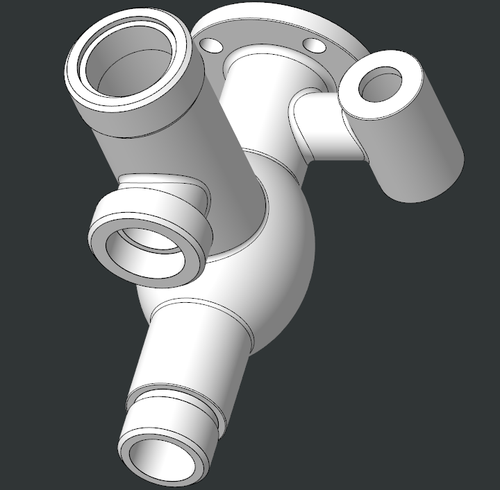
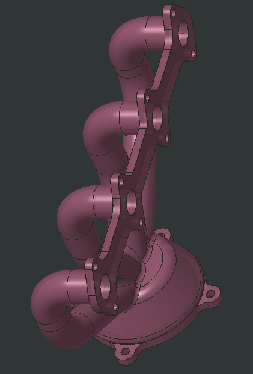
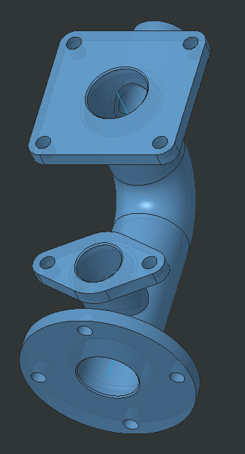
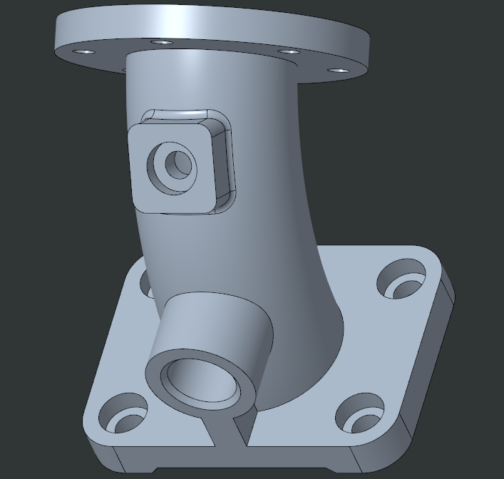

# CAD Models

A collection of mechanical CAD models created using PTC Creo.

This repository contains different individual CAD models covering housings, pipe fittings, manifolds, and other mechanical components.

## Models

### 01. Multi-Port Housing

3D CAD model of a multi-port housing with cylindrical interfaces and curved transitions.

### 02. Exhaust Manifold

CAD model of an exhaust manifold with multiple curved runners, mounting flanges, and a common outlet.

### 03. Pipe Fitting

3D CAD model of a multi-branch pipe fitting with flanged connections and cylindrical outlets.

### 04. Flange Mount

CAD model of a flanged mounting component with a curved body, mounting holes, and an integrated cylindrical connection.

## Software Used

- PTC Creo

## About the Models

These models were created as part of my CAD practice in PTC Creo, focusing on building mechanical components from sketches and developing them into detailed 3D solid models.

The models cover different forms of mechanical geometry, including curved pipe sections, flanged connections, cylindrical housings, mounting features, and multi-branch components. The collection reflects my practice with creating and refining solid geometry, adding functional features, and maintaining clean, manufacturable-looking forms.
